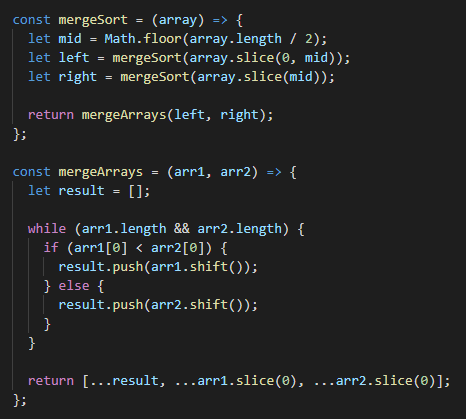
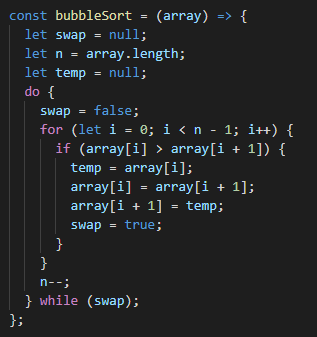
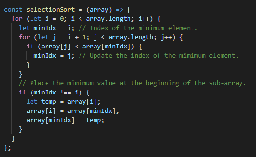
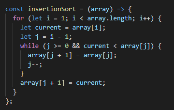

# AlgoRacer

## Description

A sorting algorithm visualizer created using React that races a variety of sorting algorithms against one another to compare their efficiency.
Try it out at https://algoracer.herokuapp.com/.

## Merge Sort

### Time Complexity:

**Best-case:** `Ω(nlog(n))`
**Average-case:** `θ(nlog(n))`
**Worst-case:** `O(nlog(n))`

## Bubble Sort

### Time Complexity:

**Best-case:** `Ω(n)`
**Average-case:** `θ(n^2)`
**Worst-case:** `O(n^2)`

## Selection Sort

### Time Complexity:

**Best-case:** `Ω(n^2)`
**Average-case:** `θ(n^2)`
**Worst-case:** `O(n^2)`

## Insertion Sort

### Time Complexity:

**Best-case:** `Ω(n)`
**Average-case:** `θ(n^2)`
**Worst-case:** `O(n^2)`
